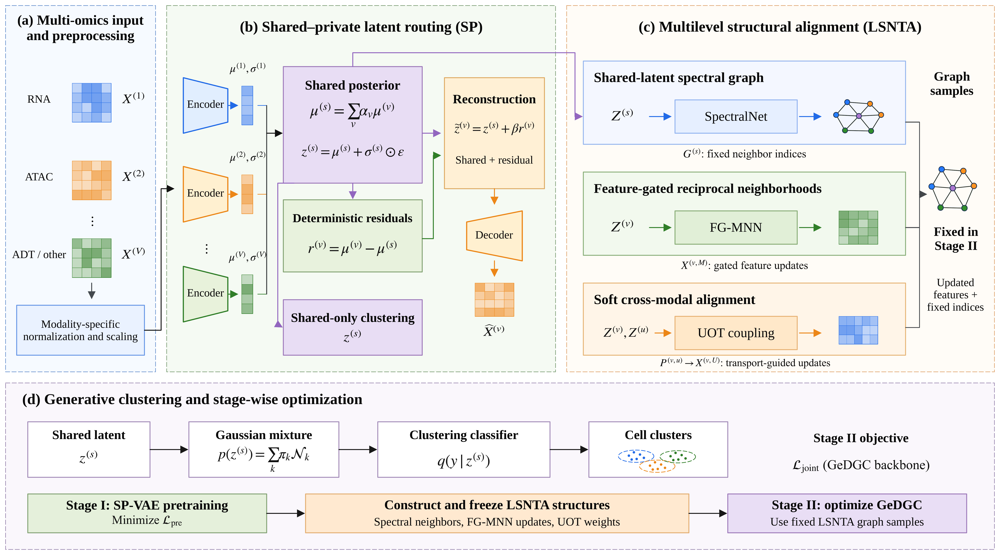

# SP-LSNTA-GeDGC

Code and selected processed datasets for the manuscript *SP-LSNTA-GeDGC:
Task-Oriented Shared-Private Routing and Multilevel Structural Alignment for
Single-Cell Multi-Omics Clustering*.

## Citation and manuscript status

The manuscript is being prepared for submission to *Cells*. Publication metadata
will be added after acceptance. Please use `CITATION.cff` to cite the associated
manuscript. Bing Zhou is the corresponding author.

**Authors:** Shizheng Zhang, Bing Zhou, Yanbu Guo, Min Huang, Wanwei Huang, and
Dongyuan Lei. **Corresponding author:** Bing Zhou
(`15290957496@163.com`). No ORCID identifiers have been provided.

## Overview

SP-LSNTA-GeDGC is a graph-embedded deep generative clustering framework for
single-cell multi-omics integration. It combines:

- **SP routing**, which uses the shared latent representation for clustering and
  deterministic modality-specific residuals only for reconstruction; and
- **LSNTA**, which combines shared-latent spectral structure, feature-gated
  mutual nearest neighbors, and unbalanced optimal transport.



## Repository contents

```text
.
├── configs/                 # Dataset registry and experiment settings
├── data/
│   ├── processed/           # Four selected processed datasets are added here
│   ├── dataset_manifest.csv # File names, checksums, and upstream sources
│   └── README.md            # Data availability and placement instructions
├── docs/                    # Framework figure and release notes
├── results/                 # Manuscript result table; generated runs are ignored
├── scripts/                 # Upstream-data listing/download and checksum checks
├── src/                     # Model implementation
├── tests/                   # Lightweight release checks
├── run.py                   # One-dataset-at-a-time entry point
└── CITATION.cff
```

## Installation

```bash
conda env create -f environment.yml
conda activate sp-lsnta-gedgc
```

Alternatively:

```bash
python -m pip install -r requirements.txt
```

The code was prepared for GPU execution. CPU execution is syntactically
supported but can be impractical because the implementation constructs dense
spectral-distance and neighborhood matrices.

## Data availability

Place the following processed files in `data/processed/` before running the
corresponding experiments:

| Dataset | Canonical file | Repository status |
| --- | --- | --- |
| Chen-2019 | `Chen-2019.h5mu` | Included after the release package is populated |
| Kidney | `Kidney.h5mu` | Included after the release package is populated |
| multiome | `multiome.h5mu` | Included after the release package is populated |
| dyngen_branching | `dyngen_branching.h5mu` | Included after the release package is populated |
| Pbmc10k | `Pbmc10k.h5mu` | Not stored in Git because it exceeds GitHub's regular-file limit |
| opmultiome | `opmultiome.h5mu` | Not stored in Git because it exceeds GitHub's regular-file limit |
| TEA-seq | `TEA-seq.h5mu` | Not stored in Git because it exceeds GitHub's regular-file limit |

The `data/README.md` file documents the public upstream sources, file checksums,
and important reconstruction limits. In particular, the original exact H5MU
construction scripts were not available in the supplied project and are not
claimed to be reconstructed here.

After adding the four selected files, verify them with:

```bash
python scripts/verify_data.py
```

To verify all seven files in a local full-data installation, use
`python scripts/verify_data.py --scope all`.

> **Important:** The four small processed files must be added with GitHub
> Desktop or Git command line. Do not use the GitHub web uploader for `Kidney`,
> because its size exceeds the web uploader's per-file limit. The `.gitignore`
> file is intentionally configured to allow only these four canonical H5MU files.

## Run an experiment

Run one dataset at a time:

```bash
python run.py --dataset Chen-2019
```

Useful checks:

```bash
python run.py --list-datasets
python run.py --dataset TEA-seq --dry-run
python -m unittest discover -s tests -v
```

If a complete set of pretrained VAE, GMM, and classifier checkpoints is absent,
the entry point starts pretraining automatically. Generated checkpoints, results,
logs, and intermediate files are intentionally excluded from version control.

## Results

`results/paper_results.csv` records the GeDGC and SP-LSNTA-GeDGC results reported
in the manuscript for the seven study datasets. These are manuscript values, not
newly generated results in this repository. Re-run experiments write separate
files under `results/<dataset>/`.

## License and third-party material

No software license was supplied with the original experiment package. The code
is therefore published with an all-rights-reserved notice until the authors
approve an explicit open-source license. See `LICENSE_NOTICE.md` and
`THIRD_PARTY_NOTICES.md`. Public dataset sources remain subject to their own
terms and access conditions.

## Data availability statement for the manuscript

> The source code, configuration files, scripts, and selected processed datasets
> (Chen-2019, Kidney, multiome, and dyngen_branching) are publicly available at
> [GitHub repository URL]. Processed Pbmc10k, opmultiome, and TEA-seq files are
> not stored directly in the repository because they exceed GitHub's regular-file
> size limit. Their public upstream sources, download instructions, and expected
> processed-file specifications are documented in the repository. Original data
> are available from the repositories cited in the corresponding dataset
> descriptions; controlled-access data remain subject to the relevant access
> requirements.
